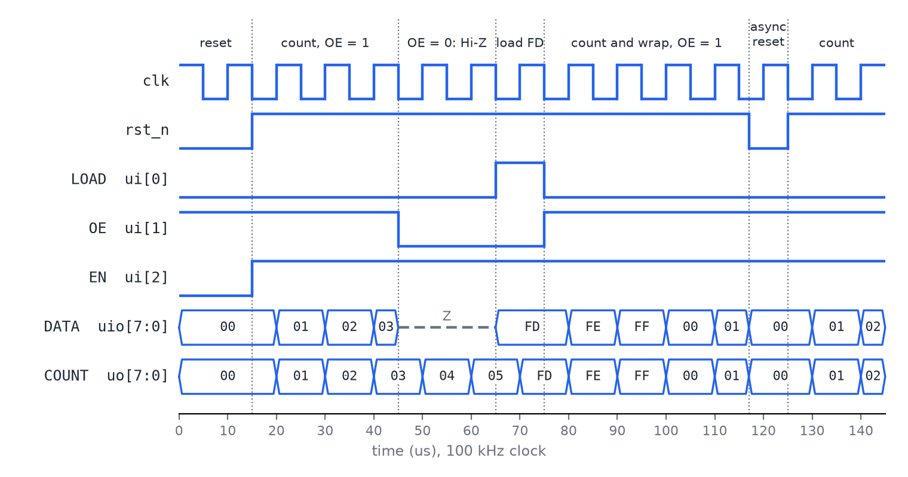

<!---

This file is used to generate your project datasheet. Please fill in the information below and delete any unused
sections.

You can also include images in this folder and reference them in the markdown. Each image must be less than
512 kb in size, and the combined size of all images must be less than 1 MB.
-->

## How it works

8 bit programmable binary up counter w/ async reset, sync load, and tristate output

The count is held in an 8-bit register that updates on the rising edge of `clk`. The inputs have this priority:

| rst_n | LOAD | OE | EN | Next count                                          |
|-------|------|----|----|-----------------------------------------------------|
| 0     | x    | x  | x  | 0, immediately (asynchronous: no clock edge needed) |
| 1     | 1    | 0  | x  | the value on DATA[7:0] (synchronous load)           |;
| 1     | 1    | 1  | x  | count (hold: the bus is ignored while OE = 1)       |
| 1     | 0    | x  | 1  | count + 1 (255 wraps around to 0)                   |
| 1     | 0    | x  | 0  | count (hold)                                        |

- OE = 1: DATA[7:0] drives the count.
- OE = 0: DATA[7:0] is high impedance (Hi-Z). The pins act as inputs, so another device can drive the bus.

OE doesn't wait for the clock, and it works during reset too. The counter keeps counting while its outputs are in
Hi-Z.

**Loading a value.** The counter needs 8 data inputs plus LOAD, OE and EN, which is more than the 8 dedicated inputs, so the load data comes in over DATA[7:0]. DATA is a shared bus.

While OE = 1 the counter ignores the bus, so LOAD just holds the current count, whatever else is on the pins.

COUNT[7:0] (`uo_out`) always shows the count, even while DATA is in Hi-Z, so the counter can be watched at any time.

The design is split into two files: `src/counter.v` is the counter itself, and `src/project.v` is the Tiny Tapeout wrapper that maps it to the pins.

### Pinout

| Pin        | Name       | Direction     | Description                                               |
|------------|------------|---------------|-----------------------------------------------------------|
| `clk`      | clk        | input         | Counter clock (rising edge)                               |
| `rst_n`    | rst_n      | input         | Asynchronous reset, active low: count = 0                 |
| `ui[0]`    | LOAD       | input         | Synchronous load, active high: count = DATA on next clock (while OE = 0) |
| `ui[1]`    | OE         | input         | Output enable, active high: drive the count onto DATA     |
| `ui[2]`    | EN         | input         | Count enable, active high: count up on each clock         |
| `ui[7:3]`  | -          | input         | Unused                                                    |
| `uo[7:0]`  | COUNT[7:0] | output        | Current count, always driven                              |
| `uio[7:0]` | DATA[7:0]  | bidirectional | Tri-state bus: count out when OE = 1, load data in when OE = 0 |

## How to test

**Sims**: The cocotb testbench in `test/` runs these tests:

- async reset w/ clock stopped
- counting through all 256 values and wrapping from 255 to 0, and holding with EN = 0
- sync load: nothing changes before the clock edge, and LOAD has priority over EN
- loading every value 0 to 255 from a different starting value
- the tristate bus: Hi-Z with OE = 0, the count with OE = 1, OE acting without a clock and during reset, and counting continuing while the bus is Hi-Z
- LOAD with OE = 1 holding the count, `even with another device driving the bus at the same time
- all 32 patterns of the unused inputs ui[7:3] having no effect
- 3000 cycles of random LOAD, OE, EN, reset and bus activity, checked against a reference model

`test/tb.v` models the `uio` pads as a tristate bus with an external. To run the tests locally:

```sh
cd test
make -B
```

The waveform below is from a simulation of the design. It shows a reset, counting with OE = 1, the DATA bus going
Hi-Z while OE = 0 (the count keeps going), loading FD from the bus, wrapping from FF to 00, and an asynchronous reset in the middle of a clock cycle. The count clears at once, with no clock edge, and the clock edge during reset has no effect.



## External hardware

None
